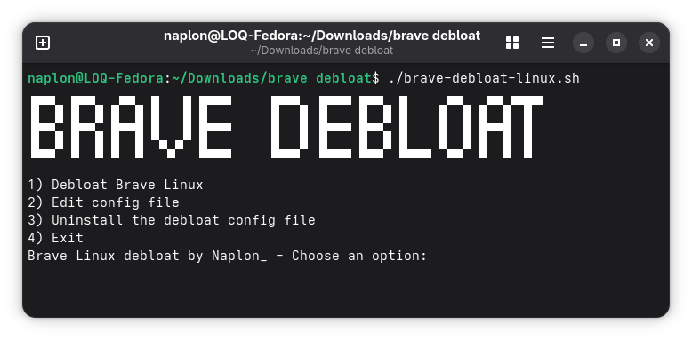

<div align="center">

</div>
A simple script that installs a managed `policies.json` to disable unnecessary Brave features and provide a privacy-focused default configuration.

## Default changes

* Disables Brave Rewards
* Disables Brave AI features
* Disables cryptocurrency-related features
* Disables the built-in password manager (use a dedicated password manager such as Dashlane or ProtonPass instead)
* Everything can be disabled/enabled to your pleasing!

> [!NOTE]
> The managed policies used by this project may not work with the Flatpak version of Brave. Installing Brave from the official website repository is recommended.

## Installation (Be aware that you may be asked for sudo permision)

Open a terminal and run:
```sh
bash <(curl -fsSL https://raw.githubusercontent.com/naplon74/brave-linux-debloat/refs/heads/main/brave-debloat-linux.sh)
```


or download `brave-debloat-linux.sh`. And run:

```sh
chmod +x brave-debloat-linux.sh
./brave-debloat-linux.sh
```

The script installs the policy file to:

```text
/etc/brave/policies/managed/policies.json
```

To edit the policy file later:

```sh
sudo nano /etc/brave/policies/managed/policies.json
```

You can verify that the policies are applied by visiting:

```text
brave://policy
```

## Uninstall

Remove the managed policy file:

```sh
sudo rm /etc/brave/policies/managed/policies.json
```

## Documentation
- See [Brave policies explained](https://github.com/naplon74/brave-linux-debloat/wiki/Brave-policies-explained) for more information about the policies.

⭐ If you find yourself using my little script consider staring the project, support is always appreciated!
